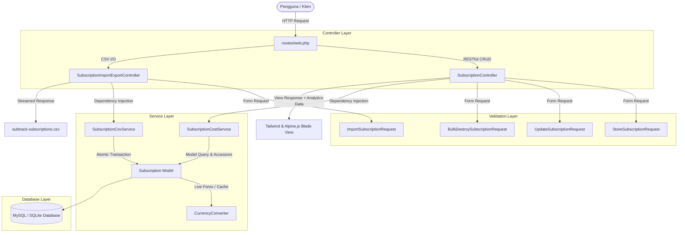

# SubTrack — Recurring Cost & Subscription Intelligence Dashboard

**Solusi *Local-First SaaS & Subscription Cost Intelligence* untuk Normalisasi Beban Finansial Multi-Siklus dan Multi-Mata Uang Menjadi Proyeksi Arus Kas yang Terukur.**

[](https://laravel.com)
[](https://php.net)
[](https://tailwindcss.com)
[](https://alpinejs.dev)
[](https://phpunit.de)
[](LICENSE)

---

## 📸 Visual Showcase

### 1. 📊 Analitik Pengeluaran & Intelijen Alokasi Kategori

Dasbor visualisasi metrik utama: total beban bulanan, proyeksi tahunan, utilisasi pagu anggaran (*budget cap*), penghitung tagihan terlewat/segera jatuh tempo, dan bilah distribusi proporsi kategori interaktif.


### 2. 💳 Distribusi Pembayaran & Manajemen Data (Tabel, Filter & CSV)

Wawasan arus kas berdasarkan instrumen pembayaran (*Cashflow Risk Warning*), filter multi-kriteria instan, batch import/export CSV, seleksi massal, dan pengelolaan data langganan *real-time*.


---

## 🌟 Fitur Unggulan (Core Highlights)

- 🔄 **Multi-Cycle Cost Normalization & Multi-Currency Engine:**
  - Menghitung otomatis ekuivalen biaya bulanan dan proyeksi tahunan dari berbagai siklus (*monthly*, *quarterly*, *yearly*).
  - Mendukung konversi multi-mata uang (`IDR`, `USD`, `EUR`, `SGD`, `GBP`) dengan integrasi kurs valas real-time API publik serta sistem *cache fallback* 6 jam.

- 🛡️ **Cashflow & Payment Insights:**
  - Pemetaan beban dominan pengeluaran berdasarkan instrumen (*Credit Card, GoPay/E-Wallet, Bank Transfer*).
  - Mendeteksi risiko arus kas jika suatu metode pembayaran melampaui batas toleransi beban (>40% dari total pengeluaran).

- ⏳ **Renewal Urgency & Lifecycle Alerts:**
  - Sistem penanda status otomatis:
    - ⚠️ **Overdue:** Tagihan yang telah melewati tanggal jatuh tempo.
    - ⏳ **Renewing Soon:** Peringatan perpanjangan mendekati hari-H ($\le 7$ hari).
  - *Dynamic pulse animation* untuk menarik atensi terhadap tagihan prioritas.

- 🏗️ **Decoupled Architecture & Single Responsibility Principle (SRP):**
  - **Form Request Layer (`app/Http/Requests/`)**: Validasi terisolasi untuk `StoreSubscriptionRequest`, `UpdateSubscriptionRequest`, `ImportSubscriptionRequest`, dan `BulkDestroySubscriptionRequest`.
  - **Service Layer (`app/Services/`)**:
    - `SubscriptionCostService`: Seluruh kalkulasi agregasi pengeluaran, metrik rasio pagu anggaran, serta distribusi kategori/metode bayar.
    - `SubscriptionCsvService`: Pipeline pengolahan stream CSV ekspor ber-BOM UTF-8 dan parser impor toleran format dengan transaksi atomik DB.
    - `CurrencyConverter`: Pengambilan kurs valas eksternal dengan caching dan graceful degradation.
  - **Dedicated Controller (`app/Http/Controllers/`)**:
    - `SubscriptionImportExportController`: Khusus menangani stream CSV import/export.
    - `SubscriptionController`: Sangat ringkas (<100 baris) khusus alur RESTful standar.

- 📥 **Enterprise-Grade CSV Import & Export:**
  - **Export:** Menggunakan `StreamedResponse` hemat memori dengan *UTF-8 Byte Order Mark (BOM)* agar kompatibel sempurna saat dibuka di Microsoft Excel.
  - **Import:** Pendeteksi otomatis pemisah (*delimiter auto-detection* `,`, `;`, `\t`), pembersihan berbagai format angka desimal/ribuan, serta dibungkus dalam `DB::transaction`.

- ♿ **A11y, SEO & Performance Compliant:**
  - Desain gelap berstandar kontras warna **WCAG AA** ($\ge 4.5:1$).
  - Optimasi penuh *Screen Reader* dan *AI Agentic Browsing Accessibility Tree* (`aria-label`, semantic labels, keyboard navigation).
  - Skor Audit Google Lighthouse: **Accessibility 100**, **Best Practices 100**, **SEO 100**.

---

## 🏛️ Arsitektur Sistem



---

## 🛠️ Tech Stack

| Layer | Teknologi | Keterangan |
| :--- | :--- | :--- |
| **Backend Framework** | Laravel 11 / 12 | Arsitektur MVC modern, Eloquent ORM, Database Transactions |
| **Language** | PHP 8.2+ | Strict typing, Constructor property promotion, Match expressions |
| **Frontend Styling** | Tailwind CSS 3.4+ | Dark/Light theme, Glassmorphism, Micro-interactions, WCAG AA |
| **Interactivity** | Alpine.js 3.x | Reactive client-side search, filtering, modal state, multi-select |
| **Testing Engine** | PHPUnit | 17 Feature & Unit Tests (65 Assertions) |
| **Exchange Rate API** | Open Exchange Rates API | Auto-cached 6 hours with fallback default rates |

---

## 🚀 Panduan Memulai (Quick Start)

### 1. Prasyarat Sistem

- PHP `>= 8.2` (Ekstensi: `pdo`, `mbstring`, `openssl`, `curl`, `fileinfo`)
- Composer
- Node.js & NPM
- MySQL / MariaDB / SQLite

### 2. Instalasi & Setup

```bash
# 1. Klon repositori
git clone https://github.com/Nabil-Fauzan/subtrack.git
cd subtrack

# 2. Pasang dependensi PHP & Node.js
composer install
npm install

# 3. Konfigurasi Environment
cp .env.example .env
php artisan key:generate

# 4. Sesuaikan konfigurasi koneksi DB pada file .env, lalu jalankan migrasi & seeder
php artisan migrate --seed

# 5. Kompilasi aset frontend
npm run build

# 6. Jalankan server lokal
php artisan serve
```

Aplikasi sekarang dapat diakses melalui peramban di: `http://127.0.0.1:8000`.

---

## 🧪 Pengujian & Jaminan Kualitas

Aplikasi dilengkapi dengan rangkaian pengujian otomatis (*Automated Feature & Unit Testing*) untuk menjamin tidak adanya regresi pada logika analitik kalkulasi, validasi form request, alur impor/ekspor CSV, maupun manipulasi status langganan.

Jalankan pengujian menggunakan PHPUnit:

```bash
php artisan test
```

### Hasil Uji Rangkaian

```text
PASS  Tests\Feature\SubscriptionControllerTest
✓ it displays the subscription analyzer dashboard with metrics
✓ it can seed demo data successfully
✓ it can store a new subscription with valid data
✓ it validates required fields when storing a subscription
✓ it can update an existing subscription
✓ it can toggle the subscription active status
✓ it can delete a subscription
✓ it can bulk delete multiple subscriptions
✓ it can export subscriptions to csv with proper headers and bom
✓ it can import valid subscriptions from csv
✓ it rejects invalid csv import file

PASS  Tests\Unit\SubscriptionCostServiceTest
✓ it accurately calculates total monthly and yearly normalized costs
✓ it calculates budget percentage and overbudget difference
✓ it correctly calculates category breakdown spending
✓ it flags heavy burden payment methods exceeding 40 percent

Tests:    17 passed (65 assertions)
Duration: 0.85s
```

---

## 📄 Lisensi

Proyek ini dilisensikan di bawah lisensi [MIT License](LICENSE).

---

*Dikembangkan untuk manajemen biaya berulang dan pemantauan langganan yang transparan dan cerdas.*
