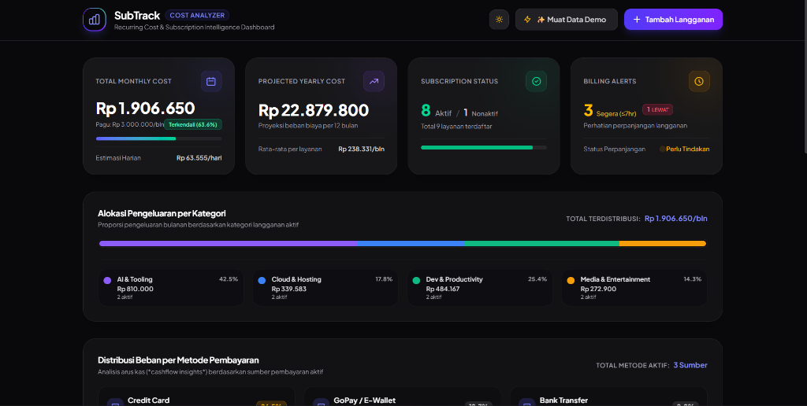
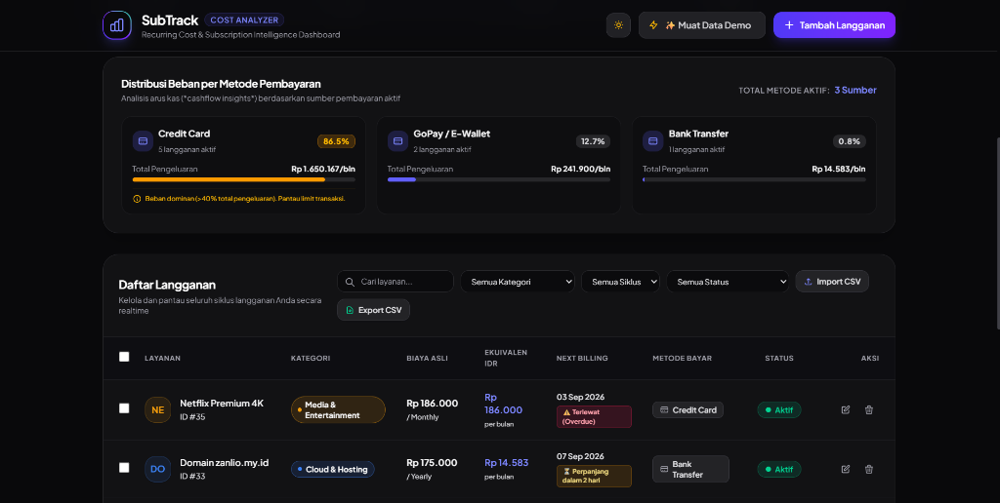
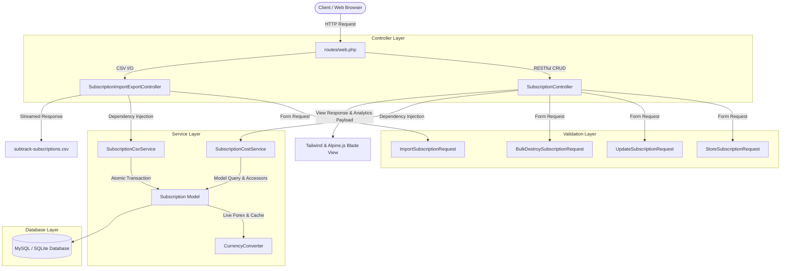

# SubTrack — Recurring Cost & Subscription Intelligence Dashboard

**A local-first SaaS and subscription cost intelligence tool designed to normalize multi-cycle and multi-currency expenses into actionable, predictable cash flow projections.**

[](https://laravel.com)
[](https://php.net)
[](https://tailwindcss.com)
[](https://alpinejs.dev)
[](https://phpunit.de)
[](LICENSE)

---

## 📸 Visual Showcase

### 1. Expense Analytics & Category Allocation Intelligence

Key financial metric visualization: total monthly cost, annualized run rate, budget utilization cap, overdue and upcoming renewal counters, alongside an interactive categorical expense distribution bar.



### 2. Payment Distribution & Data Management (Table, Filters & CSV Pipeline)

Cash flow insights mapped across payment instruments (*Cash Flow Risk Warnings*), instant multi-criteria filtering, batch CSV export/import, bulk selection, and real-time subscription lifecycle management.



---

## 🌟 Key Features

- 🔄 **Multi-Cycle Cost Normalization & Multi-Currency Engine:**
  - Automatically calculates monthly and yearly normalized equivalents across diverse billing cadences (*monthly*, *quarterly*, *yearly*).
  - Supports multi-currency conversion (`IDR`, `USD`, `EUR`, `SGD`, `GBP`) with real-time public exchange rate integration and a resilient 6-hour cache fallback mechanism.

- 🛡️ **Cash Flow & Payment Insights:**
  - Evaluates spending dominance across payment channels (*Credit Card, GoPay/E-Wallet, Bank Transfer*).
  - Flags cash flow risks if any single payment instrument exceeds 40% of total recurring expenses to prevent credit limit exhaustion.

- ⏳ **Renewal Urgency & Lifecycle Alerts:**
  - Automated status badges for overdue invoices and upcoming billing deadlines ($\le 7$ days).
  - Dynamic pulse indicators to draw immediate attention toward urgent renewal actions.

- 🏗️ **Decoupled Architecture & Single Responsibility Principle (SRP):**
  - **Form Request Layer (`app/Http/Requests/`)**: Isolated validation logic via `StoreSubscriptionRequest`, `UpdateSubscriptionRequest`, `ImportSubscriptionRequest`, and `BulkDestroySubscriptionRequest`.
  - **Service Layer (`app/Services/`)**:
    - `SubscriptionCostService`: Aggregates recurring expenses, budget cap thresholds, category distribution, and payment breakdown analytics.
    - `SubscriptionCsvService`: High-performance UTF-8 BOM streaming export and robust format-tolerant batch import encapsulated in atomic database transactions.
    - `CurrencyConverter`: Resilient external forex rate fetching with caching and graceful degradation defaults.
  - **Dedicated Controllers (`app/Http/Controllers/`)**:
    - `SubscriptionImportExportController`: Isolated controller handling CSV streaming download and batch upload pipelines.
    - `SubscriptionController`: Extremely lean resource controller (<100 lines) dedicated strictly to standard RESTful actions.

- 📥 **Enterprise-Grade CSV Import & Export:**
  - **Export:** Memory-efficient `StreamedResponse` formatted with UTF-8 Byte Order Mark (BOM) for native, flawless compatibility in Microsoft Excel and spreadsheet tools.
  - **Import:** Automated delimiter detection (`,`, `;`, `\t`), multi-format numeric sanitization, and atomic transactional rollback on invalid records.

- ♿ **A11y, SEO & Performance Compliant:**
  - Fully compliant with **WCAG AA** ($\ge 4.5:1$) high-contrast standards across dark and light modes.
  - Optimized Accessibility Tree for Screen Readers and AI Agentic Browsers (`aria-label`, explicit form controls, semantic markup).
  - Perfect Google Lighthouse audit scores: **Accessibility 100**, **Best Practices 100**, **SEO 100**.

---

## 🏛️ System Architecture



---

## 🛠️ Tech Stack

| Layer | Technology | Description |
| :--- | :--- | :--- |
| **Backend Framework** | Laravel 11 / 12 | Modern MVC architecture, Eloquent ORM, Database Transactions |
| **Language** | PHP 8.2+ | Strict typing, Constructor property promotion, Match expressions |
| **Frontend Styling** | Tailwind CSS 3.4+ | Dark/Light theme, Glassmorphism, Micro-interactions, WCAG AA compliant |
| **Interactivity** | Alpine.js 3.x | Reactive client-side search, filtering, modal state, bulk actions |
| **Testing Engine** | PHPUnit | 17 Feature & Unit Tests (65 Assertions) |
| **Exchange Rate API** | Open Exchange Rates API | Auto-cached for 6 hours with offline default fallback rates |

---

## 🚀 Getting Started

### 1. Prerequisites

- PHP `>= 8.2` (Extensions: `pdo`, `mbstring`, `openssl`, `curl`, `fileinfo`)
- Composer
- Node.js & NPM
- MySQL / MariaDB / SQLite

### 2. Installation & Setup

```bash
# 1. Clone repository
git clone https://github.com/Nabil-Fauzan/subtrack.git
cd subtrack

# 2. Install PHP and Node.js dependencies
composer install
npm install

# 3. Configure environment
cp .env.example .env
php artisan key:generate

# 4. Configure database credentials in .env, then run migrations and seeders
php artisan migrate --seed

# 5. Compile frontend assets
npm run build

# 6. Start local development server
php artisan serve
```

The application will be accessible in your web browser at: `http://127.0.0.1:8000`.

---

## 🧪 Testing & Quality Assurance

SubTrack is backed by a comprehensive automated feature and unit test suite ensuring zero regression across financial calculations, request validation, CSV pipelines, and lifecycle mutations.

Execute the test suite using PHPUnit:

```bash
php artisan test
```

### Automated Test Results

```text
PASS  Tests\Feature\SubscriptionControllerTest
✓ it displays the subscription analyzer dashboard with metrics
✓ it can seed demo data successfully
✓ it can store a new subscription with valid data
✓ it validates required fields when storing a subscription
✓ it can update an existing subscription
✓ it can toggle the subscription active status
✓ it can delete a subscription
✓ it can bulk delete multiple subscriptions
✓ it can export subscriptions to csv with proper headers and bom
✓ it can import valid subscriptions from csv
✓ it rejects invalid csv import file

PASS  Tests\Unit\SubscriptionCostServiceTest
✓ it accurately calculates total monthly and yearly normalized costs
✓ it calculates budget percentage and overbudget difference
✓ it correctly calculates category breakdown spending
✓ it flags heavy burden payment methods exceeding 40 percent

Tests:    17 passed (65 assertions)
Duration: 0.85s
```

---

## 📄 License

This project is open-sourced software licensed under the [MIT License](LICENSE).

---

*Crafted for transparent, intelligent, and proactive subscription cost management.*
